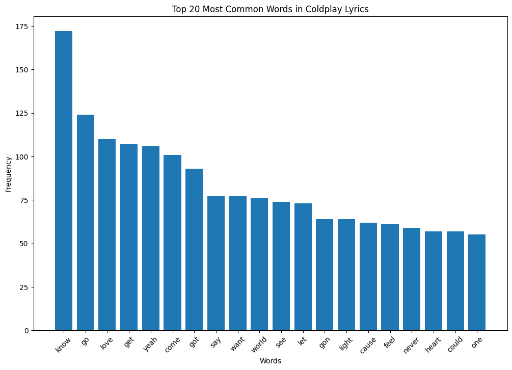
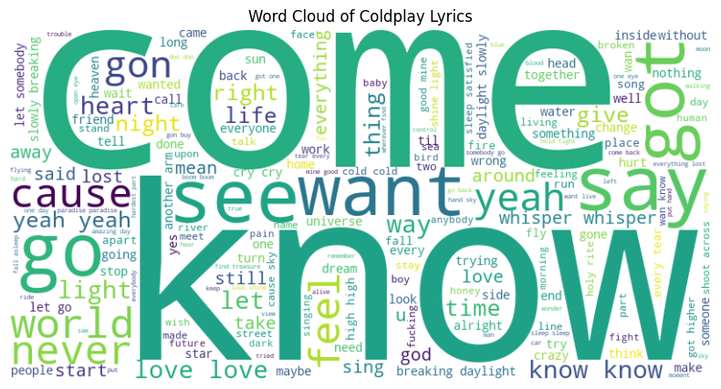
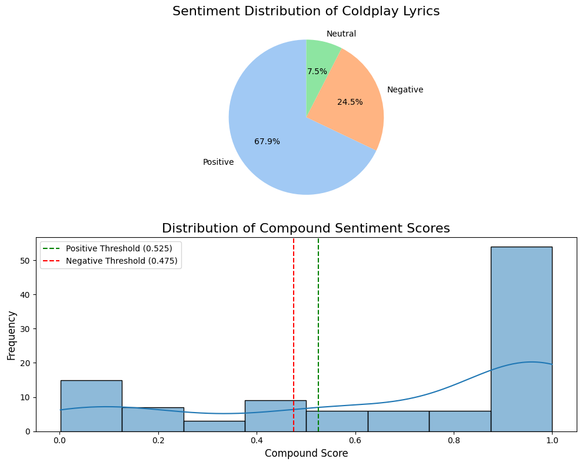
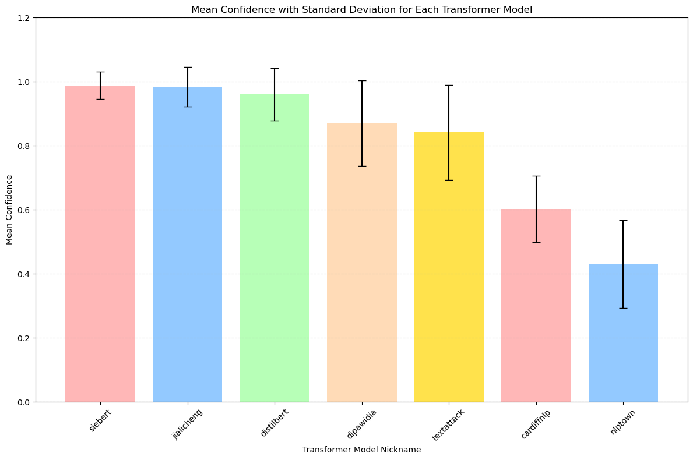
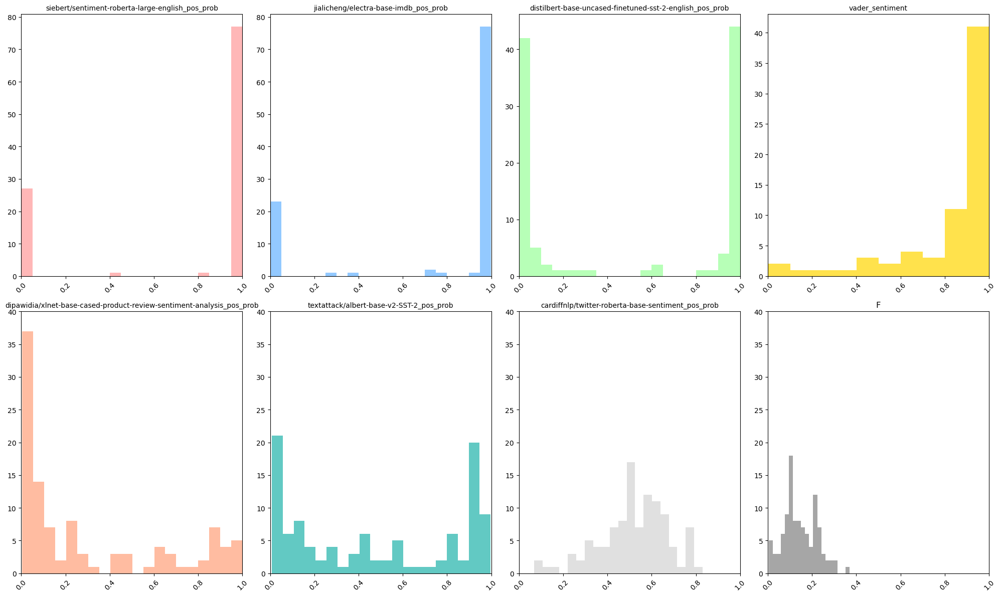
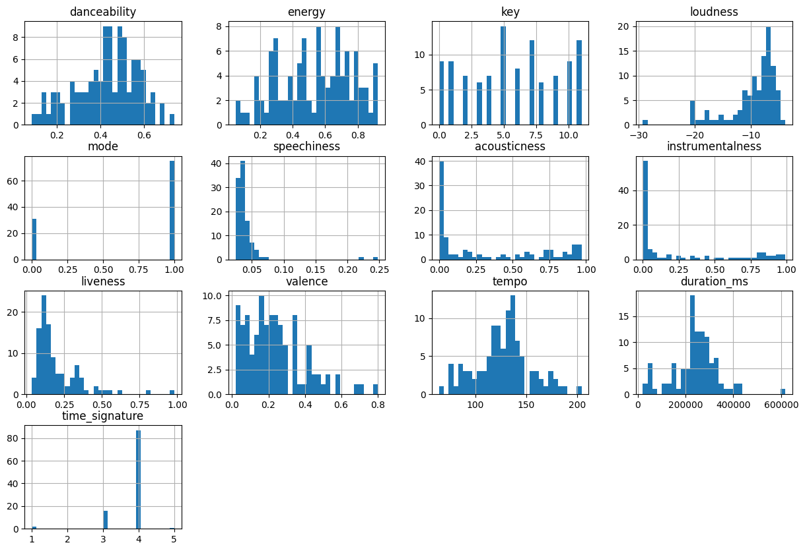
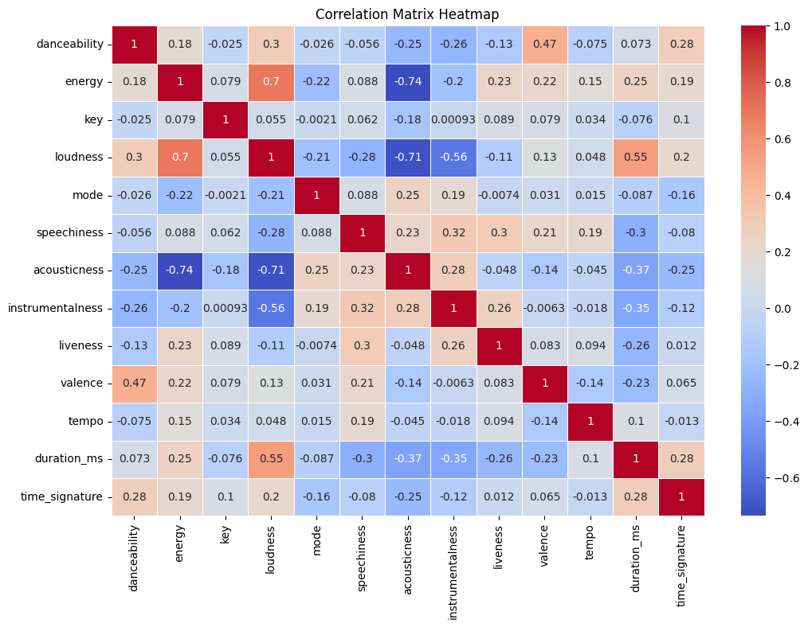

# ESG Theme Evolution in Coldplay Lyrics

## Overview
This project by Athens Analytics (ACG) explores the evolution of Environmental, Social, and Governance (ESG) themes in the lyrics of Coldplay. The analysis includes text mining, sentiment analysis, and audio feature extraction to understand how ESG themes have emerged and evolved in the band's music over time.

## Completed Tasks

### 1. Exploratory Data Analysis (EDA)
- **Top n-grams Discovery:** Identified and analyzed the most frequent n-grams in Coldplay lyrics.

- **Wordcloud Visualization:** Created wordclouds to visualize common words and phrases.

### 2. Sentiment Analysis
- **Lexicon-Based Techniques:** Used VADER dictionary to assess sentiment in the lyrics.

- **Pretrained Transformers:** Applied state-of-the-art models like BERT for nuanced sentiment analysis.

#### Model Summaries
1. **siebert/sentiment-roberta-large-english**
   - **Training Data**: English text data, focusing on general sentiment analysis.

2. **jialicheng/electra-base-imdb**
   - **Training Data**: IMDb movie reviews, focusing on sentiment analysis for movie reviews.

3. **distilbert-base-uncased-finetuned-sst-2-english**
   - **Training Data**: Stanford Sentiment Treebank (SST-2), focusing on binary sentiment classification.

4. **dipawidia/xlnet-base-cased-product-review-sentiment-analysis**
   - **Training Data**: Product reviews, focusing on sentiment analysis for product reviews.

5. **textattack/albert-base-v2-SST-2**
   - **Training Data**: Stanford Sentiment Treebank (SST-2), focusing on binary sentiment classification.

6. **cardiffnlp/twitter-roberta-base-sentiment**
   - **Training Data**: Twitter data, focusing on sentiment analysis specific to tweets.

7. **nlptown/bert-base-multilingual-uncased-sentiment**
   - **Training Data**: Multilingual text data, focusing on sentiment analysis across multiple languages.

#### Sentiment Distribution for pre-trained transformers:

### 3. Audio Feature Extraction
- **Spotify API Integration:** Retrieved and incorporated new audio features from Spotify's API to enrich the analysis.

## Next Steps

### 1. LDA Analysis
- **Topic Modeling:** Conduct Latent Dirichlet Allocation (LDA) to uncover hidden topics related to ESG themes in the lyrics.

### 2. Wordcloud R - Shiny App
- **Interactive Visualization:** Develop an interactive Shiny app in R to allow users to explore wordclouds and other visualizations dynamically.

- example [shiny-gallery](https://gallery.shinyapps.io/082-word-cloud/)
